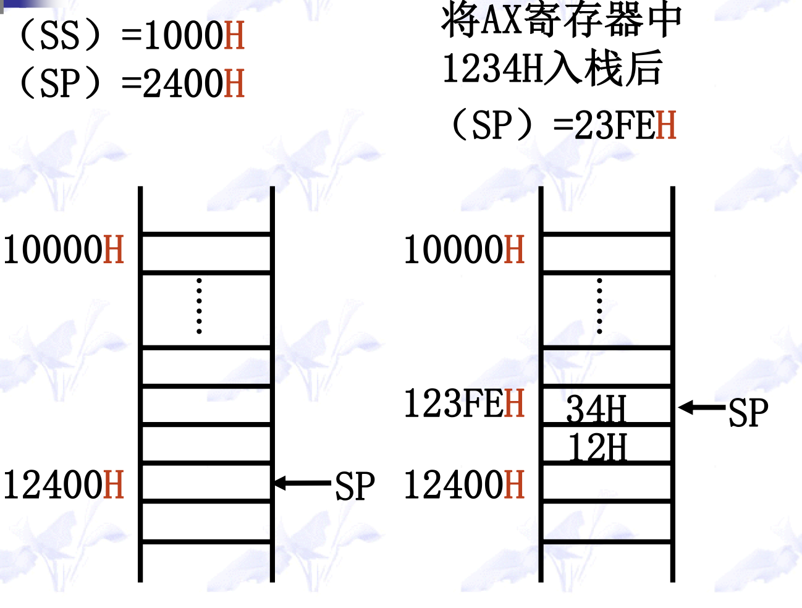

#  8086 Microprocessor Learning 


第一章 汇编语言的基础知识
1、计算机系统概述
硬件（Handware）
软件（Software）
2、汇编语言介绍
3、数据表示
1. BCD码
2. ASCII码
3. 真值和机器数
4. 补码
4、8086微处理器
1、通用寄存器
2、标志寄存器FLAGS
3、指令指针IP
4、段寄存器
段超越前缀指令
计算机中信息的单位
数据的地址对齐
存储器(men)的分段管理
5、8086寻址方式
1、指令的组成
2、8086的机器代码格式
3、立即数寻址方式
4、存储器寻址方式
1. 直接寻址方式
2. 寄存器间接寻址方式
3. 寄存器相对寻址方式
4. 基址变址寻址方式
5. 相对基址变址寻址方式
5、寻址方式的多种表示方式
6、各种操作数的表达
第二章 8086指令系统
1、数据传送类指令
1. 传送指令MOV
2. 交换指令XCHG
3. 换码指令XLAT
4. 堆栈操作指令PUSH、POP
5. 标志传送指令
6. 标志位操作指令
7、地址传送指令
有效地址传送指令 LEA
指针传送指令 LDS 和 LES
2、算术运算类指令
1、加法指令ADD、ADC、INC
2、减法指令SUB、SBB、DEC
3、求补指令 NEG
4、比较指令CMP
5、乘法指令MUL、IMUL
6、除法指令DIV、IDIV
7、符号扩展指令CBW、CWD
8、十进制调整指令
压缩BCD码调整
非压缩BCD码调整
3、位操作指令
1、逻辑或指令 AND
2、逻辑与指令 OR
3、逻辑异或指令XOR
4、逻辑非指令 NOT
5、测试指令 TEST
6、移位指令（shift）
7、循环移位指令（rotate）
4、控制转移类指令
1、无条件转移指令 JMP
2、条件转移指令 JCC
3、循环指令（loop）
4、子程序指令
5、中断指令
5、处理机控制类指令
1、空操作指令 NOP
2、段超越前缀指令
3、封锁前缀指令 LOCK
4、暂停指令 HLT
5、交权指令 ESC
6、等待指令
第三章 汇编语言程序格式
1、汇编语言程序的开发
1、汇编语言程序设计的语句格式
2、汇编语言的程序格式
3、汇编语言的开发过程
4、DOS系统功能调用
功能调用的步骤
输入输出类调用
1、字符输出：
2、字符串输出：
3、字符输入：
4、字符串输入：
5、按键判断：
2、参量、变量和符号
1、参数
1. 常数
2. 数值表达式
3. 地址型参数
2、变量定义伪指令
1. 变量名
2. 位指令助记符
3. 初值表
3、变量和标号的属性
3、程序段的定义和属性
exe程序
com程序
1、简化段定义伪指令合集
.MODEL存储模型位指令
简化段定义伪指令
.STARTUP 程序开始伪指令
EXIT [返回参数] 程序终止伪指令
END [标号] 汇编结束伪指令
2、com程序的编写
3、完整段定义伪指令
完整段定义位指令
指定段寄存器伪指令
段组伪指令
段顺序伪指令
4、简化段定义格式的段属性
第四章 基本汇编语言程序设计
1、顺序程序设计
2、分支程序设计
1、单分支程序设计
2、双分支程序设计
3、多分支程序设计
3、循环程序设计
1、冒泡法
2、串操作类指令
4、 子程序设计
1、过程定义位指令
2、子程序的参数传递
3、子程序的嵌套
4、子程序的递归
5、子程序的重入
第五章 高级汇编语言程序设计
1、高级语言特性
1、条件控制伪指令
2、循环控制伪指令
3、过程声明和过程调用伪指令
2、宏结构程序设计
1、宏汇编
a. 宏
b. 宏指令
c. 宏展开
宏的参数
宏操作符
与宏有关的伪指令
宏汇编与子程序的比较
2、重复汇编
1. 按参数值重复
2. 按参数个数重复
3. 按参数字符个数重复
3、条件汇编
宏结构的作用
3、模块化程序设计
1. 源程序文件的包含
2. 目标代码文件的连接
3. 子程序库的调入
4、输入输出程序设计
1、 输入输出指令
a. 输入指令IN
b. 输出指令OUT
2、程序直接控制输入输出
3、程序查询输入输出
4、中断服务程序
内部中断服务程序
驻留中断服务程序
外部可屏蔽中断服务程序


## 一 预备

### 1.1 计算机中的数制

无符号数的表示方法：
1. 二进制数01  （两个数字）
2. 十进制数0～9   （十个数字）
3. 十六进制数0～9、A～F  （十六个数字）


各种数制之间的转换：
1. 非十进制数到十进制数的转换：按相应进位计数制的权表达式展开，再按十进制求和。
2. 十进制数制转换为二进制数制：整数部分除2取余；小数部分乘2取整。
3. 二进制与十六进制数之间的转换：用4位二进制数表示1位十六进制数


###  1.2 计算机中的码制
对于符号数，机器数常用的表示方法有原码、反码和补码三种。


注意：
1. 对正数，三种表示法均相同。
2. 它们的差别在于对负数的表示。


原码   
符号位：0 表示正，1 表示负；
数值位：真值的绝对值。
注意：数0 的原码不唯一

反码   
若X>0 ，则 [X]反=[X]原
若X<0， 则 [X]反= 对应原码的符号位不变，数值部分按位求反
注意：数0 的反码也不唯一

补码
定义：
若X>0， 则[X]补= [X]反= [X]原
若X<0， 则[X]补= [X]反+1
注意：机器字长为8 时，数0 的补码唯一，同为 00000000


8 位二进制的表示范围：
原码：-127~+127
反码：-127~+127
补码：-128~+127


特殊数10000000   
该数在原码中定义为： -0
在反码中定义为： -127
在补码中定义为： -128
对无符号数：(10000000)２ = 128


### 1.3 信息的编码

+ **十进制数的二进制数编码**：用4 位二进制数表示一位十进制数。有两种表示法：压缩 BCD 码和非压缩BCD 码。

   + 压缩BCD码的每一位用 4 位二进制表示，0000~1001 表示0~9，一个字节表示两位十进制数。
   +  非压缩BCD码用一个字节表示一位十进制数，高4 位总是0000，低4 位的0000~1001表示0~9


+ **字符的编码**：计算机采用7位二进制代码对字符进行编码
   + 数字0~9 的编码是0110000~0111001，它们的高3 位均是011，后4位正好与其对应的二进制代码（BCD 码）相符。
   + 英文字母A~Z 的ASCII 码从1000001（41H）开始顺序递增，字母 a~z 的ASCII 码从1100001（61H）开始顺序递增，这样的排列对信息检索十分有利。

## 二 微机组成原理


### 2.1 微机的结构

**计算机的经典结构——冯.诺依曼结构**
1. 计算机由运算器、控制器、输入设备和输出设备五大部分组成（**运算器和控制器又称为 CPU**）
2. 数据和程序以二进制代码形式不加区分地存放在存储器总，存放位置由地址指定，数制为二进制。
3. 控制器是根据存放在存储器中的指令序列来操作的，并由一个程序计数器控制指令的执行。


**系统总线的分类**
1. 数据总线（Data Bus），它决定了处理器的字长。
2. 地址总线（Address Bus）,它决定系统所能直接访问的存储器空间的容量。
3. 控制总线（Control Bus）

### 2.2 8086微处理器的基本结构
+ 8086 是一种单片微处理芯片，其内部数据总线的宽度是 16 位，外部数据总线宽度也是16 位，片内包含有控制计算机所有功能的各种电路。
+ 8086 地址总线的宽度为 20 位，有1MB（2^20）寻址空间。
+ 8086CPU 由总线接口部件 BIU 和执行部件EU 组成。BIU 和EU 的操作是异步的，为8086 取指令和执行指令的并行操作体统硬件支持。

#### 2.2.1


**执行部件（EU）**
- **ALU（算术逻辑单元）**：负责进行算术运算（如加、减、乘、除）和逻辑运算（如与、或、非、异或 ）。
- **通用寄存器**：包含AX（累加器，可分成AH和AL ）、BX（基址寄存器 ）、CX（计数寄存器 ）、DX（数据寄存器 ）、SP（堆栈指针寄存器 ）、BP（基址指针寄存器 ）、SI（源变址寄存器 ）、DI（目的变址寄存器 ） ，用于暂存操作数、运算结果等数据，方便ALU快速访问数据进行运算。
- **标志寄存器**：存储运算结果的特征信息，如进位标志CF、零标志ZF、符号标志SF等 ，反映运算结果的状态，供后续指令判断使用 。
- **EU控制电路**：根据指令译码结果，产生控制信号，指挥ALU及各寄存器协调工作，完成指令规定的操作 。
- **暂存寄存器**：暂存从通用寄存器或其他部件传来的数据，供ALU运算使用。

**总线接口部件**（BIU）
- **指令队列缓冲器**：8086是6字节，8088是4字节，用于预先从存储器中取出指令并暂存，使EU能连续地获取指令，实现取指令和执行指令的重叠操作，提高CPU执行效率 。 
- **内部暂存器**：包括CS（代码段寄存器 ）、DS（数据段寄存器 ）、SS（堆栈段寄存器 ）、ES（附加段寄存器 ）、IP（指令指针寄存器 ） 。CS存放当前正在执行的指令所在代码段的段基址 ；DS存放数据段的段基址，用于访问数据 ；SS存放堆栈段的段基址 ；ES为附加段寄存器，用于存储数据 ；IP始终指向下一条要执行的指令在代码段内的偏移地址 。
- **地址加法器**：将段寄存器提供的段基址（左移4位）与偏移地址相加，形成20位的物理地址，用于访问存储器 。
- **总线控制电路**：负责与外部总线连接，产生控制信号，实现CPU与存储器、I/O设备之间的数据、地址和控制信号的传输 。 

从功能上来说分成两大部分，**总线接口单元BIU**和**执行单元EU**

+ BIU:负责完成CPU与存储器或I/O设备之间的数据传送，其具
体任务是：  
(1) BIU从内存的指定部分取出指令，送至指令队列排队  
(2) 从内存的指定部分取出执行指令时所需的操作数，送至EU部分
+ EU: 负责指令的执行。


### 总线接口单元BIU
1. 指令队列缓冲器  
a.取指时, 每当指令队列缓冲器中存满1条指令后,EU就立即执行.  
b.指令队列缓冲器中只要空出两个(对8086)或一个(对8088)指令字节时,BIU便自动执行取指操作,直到填满为止.  
c.当EU执行完转移,调用和返回指令时,则要清除指令队列缓冲器,并要求BIU从新地址重新开始取指令

2. 地址加法器和段寄存器
8086有20根地址线,但内部寄存器只有16位,那么如何用16位寄存器实现20位地址的寻址呢
**BIU中的地址加法器用来实现逻辑地址到物理地址的变换**  
8086 可同时访问4个段(CS,DS,SS,ES)，4个段寄存器中的内容指示了每个段的基地址

3. 16位指令指针(IP)
正常运行时,IP中含有BIU要取的下一条指令的偏移地址（功能与8位CPU中的PC类似）

### 执行单元 EU
EU包括:  
(1)16位算术逻辑单元:用于算术,逻辑运算,计算寻址单元的16
位偏移量   
(2)16位标志寄存器F:反映CPU运算的状态特征或存放控制标志
(3)数据暂存寄存器:暂存参加运算的数据
(4)通用寄存器组:4个16位数据寄存器AX.BX,CX,DX和4个16位
指针与变址寄存器SP,BP与SI,DI
(5)EU控制电路:对EU的各个部件实现特定的定时操作


### 寄存器（一）
8086/8088CPU中可供编程使用的有14个16位寄存器，按其用途可分为3类：**通用寄存器、段寄存器、指针和标志寄存器**


#### 通用寄存器
 - **通用数据寄存器（AX、BX、CX、DX）**：可用于暂存运算数据，参与算术和逻辑运算。AX（累加器）使用频率高，如乘法、除法等运算默认以AX为操作数或存放结果；BX可作基址寄存器，用于存储器寻址；CX常用于计数，如循环指令中自动计数；DX常配合AX进行乘除运算，存放高位数据。
 - **指针寄存器（BP、SP）**：BP（基址指针寄存器）用于访问堆栈段中的数据，常与SP配合获取堆栈中数据偏移地址；SP（堆栈指针寄存器）始终指向堆栈栈顶，用于控制堆栈操作，如入栈、出栈操作时自动调整指针。 
 - **变址寄存器（SI、DI）**：SI（源变址寄存器）、DI（目的变址寄存器）用于存储器寻址，在字符串操作等指令中，SI指向源操作数地址，DI指向目的操作数地址。 
#### 段寄存器（DS、ES、SS、CS ）
 - **DS（数据段寄存器）**：存放数据段的段基址，确定程序数据所在存储区域。
 - **ES（附加段寄存器）**：作为数据段补充，用于存储数据，在串操作等指令中可作为目的操作数所在段基址。 
 - **SS（堆栈段寄存器）**：存放堆栈段段基址，与SP配合管理堆栈空间。 
 - **CS（代码段寄存器）**：存放代码段段基址，与指令指针寄存器IP配合确定下一条要执行指令的地址。 
#### 专用寄存器
 - **IP（指令指针寄存器）**：始终指向下一条待执行指令在代码段内的偏移地址，与CS配合实现指令顺序执行及转移等操作。 
 - **FLAGS（状态标志寄存器）**：存放运算结果的状态标志（如进位标志CF、零标志ZF等）和控制标志（如中断允许标志IF等），反映运算结果特征及控制CPU操作。 


### 寄存器（二）
**AX：累加器**
所有I/O指令都通过AX（AL）与接口传送信息;
中间运算结果也多放于AX（AL）中；
乘除法指令的一个操作数必须在AX（AL）中。  
**BX：基址寄存器**
在间接寻址中用于存放操作数的基地址。  
**CX：计数寄存器**
用于在循环指令或串操作指令中存放计数值。  
**DX：数据寄存器**
在间接寻址的I/O指令中存放I/O端口地址；    
在32位乘除法运算时，存放高16位数。   
**SP：堆栈指针寄存器**  
其内容为堆栈栈顶的偏移地址；  
任何堆栈操作后，SP都会自动增/减量。     
**BP：基址指针寄存器**    
在间接寻址中用于存放操作数的基地址；   
常用于访问存放在堆栈中的数据。   


**SS及SP**
堆栈：存储器中的一块特殊存储区或段，内中数据按“先进后出”原则组织。
堆栈的段基址存放于SS中。堆栈指针寄存器SP指向堆栈栈顶（存放栈顶偏移地址）。

堆栈的其它特点  
**以字为单位操作，且对准存放；**  
入栈时，先是（SP-2）→（SP），然后数据入栈。   
出栈时，先是数据出栈，然后（SP+2）→（SP）。



**BX与BP在应用上的区别**
作为通用寄存器，二者均可用于存放数据；
作为基址寄存器，默认情况下：
用BX作为指针所访问的数据在数据段（DS段）；
用BP作为指针所访问的数据在堆栈段（SS段）。


##  指令系统

### 数据传送指令

1. 通用数据传送指令
2. 地址传送指令
3. 标志传送指令
4. 输入输出传送指令

## 通用数据传送指令

1. 基本传送指令
2. 堆栈操作指令
3. 交换指令
4. 查表指令

MOV
PUSH、POP
XCHG
XLAT


# 汇编程序写冒泡排序
```
D SEGMENT
VAR DB -1,-10,-100,27H,0AH,47H
N EQU $ - VAR
D ENDS
C SEGMENT
  ASSUME CS:C,DS:D;
B：  MOV AX,D
    MOV DS,AX
    MOV CX,N-1
    
```


