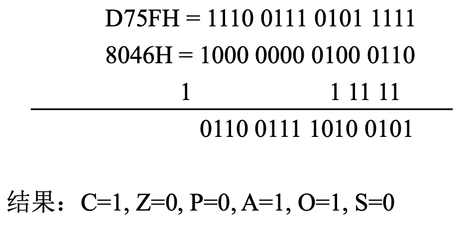
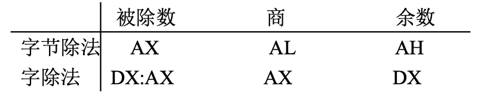

#  8086 Microprocessor Learning 

## 微处理器的内部结构


**执行部件（EU）**
- **ALU（算术逻辑单元）**：负责进行算术运算（如加、减、乘、除）和逻辑运算（如与、或、非、异或 ）。
- **通用寄存器**：包含AX（累加器，可分成AH和AL ）、BX（基址寄存器 ）、CX（计数寄存器 ）、DX（数据寄存器 ）、SP（堆栈指针寄存器 ）、BP（基址指针寄存器 ）、SI（源变址寄存器 ）、DI（目的变址寄存器 ） ，用于暂存操作数、运算结果等数据，方便ALU快速访问数据进行运算。
- **标志寄存器**：存储运算结果的特征信息，如进位标志CF、零标志ZF、符号标志SF等 ，反映运算结果的状态，供后续指令判断使用 。
- **EU控制电路**：根据指令译码结果，产生控制信号，指挥ALU及各寄存器协调工作，完成指令规定的操作 。
- **暂存寄存器**：暂存从通用寄存器或其他部件传来的数据，供ALU运算使用。

**总线接口部件**（BIU）
- **指令队列缓冲器**：8086是6字节，8088是4字节，用于预先从存储器中取出指令并暂存，使EU能连续地获取指令，实现取指令和执行指令的重叠操作，提高CPU执行效率 。 
- **内部暂存器**：包括CS（代码段寄存器 ）、DS（数据段寄存器 ）、SS（堆栈段寄存器 ）、ES（附加段寄存器 ）、IP（指令指针寄存器 ） 。CS存放当前正在执行的指令所在代码段的段基址 ；DS存放数据段的段基址，用于访问数据 ；SS存放堆栈段的段基址 ；ES为附加段寄存器，用于存储数据 ；IP始终指向下一条要执行的指令在代码段内的偏移地址 。
- **地址加法器**：将段寄存器提供的段基址（左移4位）与偏移地址相加，形成20位的物理地址，用于访问存储器 。
- **总线控制电路**：负责与外部总线连接，产生控制信号，实现CPU与存储器、I/O设备之间的数据、地址和控制信号的传输 。 

从功能上来说分成两大部分，**总线接口单元BIU**和**执行单元EU**

+ BIU:负责完成CPU与存储器或I/O设备之间的数据传送，其具
体任务是：  
(1) BIU从内存的指定部分取出指令，送至指令队列排队  
(2) 从内存的指定部分取出执行指令时所需的操作数，送至EU部分
+ EU: 负责指令的执行。


### 总线接口单元BIU
1. 指令队列缓冲器  
a.取指时, 每当指令队列缓冲器中存满1条指令后,EU就立即执行.  
b.指令队列缓冲器中只要空出两个(对8086)或一个(对8088)指令字节时,BIU便自动执行取指操作,直到填满为止.  
c.当EU执行完转移,调用和返回指令时,则要清除指令队列缓冲器,并要求BIU从新地址重新开始取指令

2. 地址加法器和段寄存器
8086有20根地址线,但内部寄存器只有16位,那么如何用16位寄存器实现20位地址的寻址呢
**BIU中的地址加法器用来实现逻辑地址到物理地址的变换**  
8086 可同时访问4个段(CS,DS,SS,ES)，4个段寄存器中的内容指示了每个段的基地址

3. 16位指令指针(IP)
正常运行时,IP中含有BIU要取的下一条指令的偏移地址（功能与8位CPU中的PC类似）

### 执行单元 EU
EU包括:  
(1)16位算术逻辑单元:用于算术,逻辑运算,计算寻址单元的16
位偏移量   
(2)16位标志寄存器F:反映CPU运算的状态特征或存放控制标志
(3)数据暂存寄存器:暂存参加运算的数据
(4)通用寄存器组:4个16位数据寄存器AX.BX,CX,DX和4个16位
指针与变址寄存器SP,BP与SI,DI
(5)EU控制电路:对EU的各个部件实现特定的定时操作


### 寄存器（一）
8086/8088CPU中可供编程使用的有14个16位寄存器，按其用途可分为3类：**通用寄存器、段寄存器、指针和标志寄存器**


#### 通用寄存器
 - **通用数据寄存器（AX、BX、CX、DX）**：可用于暂存运算数据，参与算术和逻辑运算。AX（累加器）使用频率高，如乘法、除法等运算默认以AX为操作数或存放结果；BX可作基址寄存器，用于存储器寻址；CX常用于计数，如循环指令中自动计数；DX常配合AX进行乘除运算，存放高位数据。
 - **指针寄存器（BP、SP）**：BP（基址指针寄存器）用于访问堆栈段中的数据，常与SP配合获取堆栈中数据偏移地址；SP（堆栈指针寄存器）始终指向堆栈栈顶，用于控制堆栈操作，如入栈、出栈操作时自动调整指针。 
 - **变址寄存器（SI、DI）**：SI（源变址寄存器）、DI（目的变址寄存器）用于存储器寻址，在字符串操作等指令中，SI指向源操作数地址，DI指向目的操作数地址。 
#### 段寄存器（DS、ES、SS、CS ）
 - **DS（数据段寄存器）**：存放数据段的段基址，确定程序数据所在存储区域。
 - **ES（附加段寄存器）**：作为数据段补充，用于存储数据，在串操作等指令中可作为目的操作数所在段基址。 
 - **SS（堆栈段寄存器）**：存放堆栈段段基址，与SP配合管理堆栈空间。 
 - **CS（代码段寄存器）**：存放代码段段基址，与指令指针寄存器IP配合确定下一条要执行指令的地址。 
#### 专用寄存器
 - **IP（指令指针寄存器）**：始终指向下一条待执行指令在代码段内的偏移地址，与CS配合实现指令顺序执行及转移等操作。 
 - **FLAGS（状态标志寄存器）**：存放运算结果的状态标志（如进位标志CF、零标志ZF等）和控制标志（如中断允许标志IF等），反映运算结果特征及控制CPU操作。 


### 寄存器（二）
**AX：累加器**
所有I/O指令都通过AX（AL）与接口传送信息;
中间运算结果也多放于AX（AL）中；
乘除法指令的一个操作数必须在AX（AL）中。  
**BX：基址寄存器**
在间接寻址中用于存放操作数的基地址。  
**CX：计数寄存器**
用于在循环指令或串操作指令中存放计数值。  
**DX：数据寄存器**
在间接寻址的I/O指令中存放I/O端口地址；    
在32位乘除法运算时，存放高16位数。   
**SP：堆栈指针寄存器**  
其内容为堆栈栈顶的偏移地址；  
任何堆栈操作后，SP都会自动增/减量。     
**BP：基址指针寄存器**    
在间接寻址中用于存放操作数的基地址；   
常用于访问存放在堆栈中的数据。   


**SS及SP**
堆栈：存储器中的一块特殊存储区或段，内中数据按“先进后出”原则组织。
堆栈的段基址存放于SS中。堆栈指针寄存器SP指向堆栈栈顶（存放栈顶偏移地址）。

堆栈的其它特点  
**以字为单位操作，且对准存放；**  
入栈时，先是（SP-2）→（SP），然后数据入栈。   
出栈时，先是数据出栈，然后（SP+2）→（SP）。



**BX与BP在应用上的区别**
作为通用寄存器，二者均可用于存放数据；
作为基址寄存器，默认情况下：
用BX作为指针所访问的数据在数据段（DS段）；
用BP作为指针所访问的数据在堆栈段（SS段）。


##  指令系统

### 数据传送指令

1. 通用数据传送指令
2. 地址传送指令
3. 标志传送指令
4. 输入输出传送指令

## 通用数据传送指令

1. 基本传送指令
2. 堆栈操作指令
3. 交换指令
4. 查表指令

MOV
PUSH、POP
XCHG
XLAT


# 汇编程序写冒泡排序
```
D SEGMENT
VAR DB -1,-10,-100,27H,0AH,47H
N EQU $ - VAR
D ENDS
C SEGMENT
  ASSUME CS:C,DS:D;
B：  MOV AX,D
    MOV DS,AX
    MOV CX,N-1
    
```


